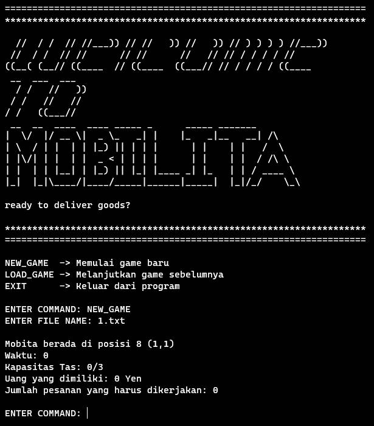
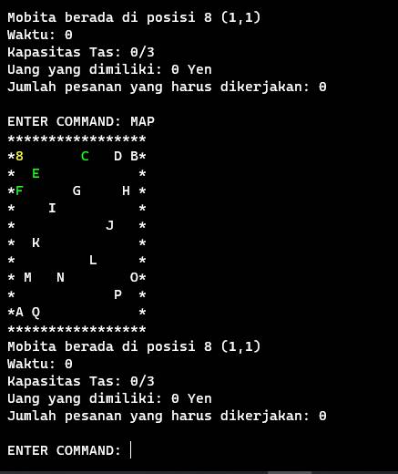
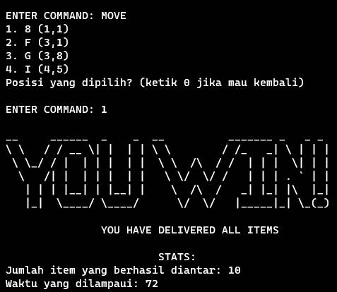

# Mobilita
Disusun untuk Tugas Besar IF2110 Algoritma dan Struktur Data

## Daftar Isi
* [Penjelasan Ringkas Program](#penjelasan-ringkas-program)
* [Cara Kompilasi Program](#cara-kompilasi-program)
* [Cara Menjalankan Program](#cara-menjalankan-program)
* [Screenshot program](#screenshot-program)
* [Daftar Fitur](#daftar-fitur)
* [Struktur Program](#struktur-program)
* [Pembagian Tugas](#pembagian-tugas)

## Penjelasan Ringkas Program
Mobilita adalah sebuah permainan yang mensimulasikan tentang pengantaran barang. Secara garis besar, pemain pertama-tama berada pada lokasi Headquarters yang akan mendapatkan jumlah pesanan yang harus diselesaikan seiring waktu. Tujuan permainan  adalah menyelesaikan pesanan dengan waktu secepat mungkin. Permainan akan selesai jika semua pesanan selesai diantar dan pemain berada pada lokasi Headquarters. Ketika berada pada Headquarters, pemain akan mendapatkan pesan bahwa game sudah selesai, berapa jumlah item yang berhasil diantar, serta berapa lama waktu yang sudah dilampaui.

## Cara Kompilasi Program
1. Pastikan gcc compiler versi terbaru sudah terpasang pada mesin eksekusi (Anda dapat mengecek versi gcc compiler dengan menjalankan command `gcc --version` pada command prompt).
2. Jalankan command `make` pada command prompt untuk melakukan kompilasi pada program.
3. Jika berhasil dikompilasi, maka akan terdapat `main.exe` pada directory program.

## Cara Menjalankan Program
1. Pastikan Anda telah melakukan kompilasi pada program.
2. Jalankan command `./main` untuk run program.
3. Jika berhasil run, maka Anda akan tiba pada Main Menu program.

## Screenshot Program
### Tampilan Main Menu

### Tampilan Game Mechanics

### Tampilan End Game


## Daftar Fitur
1. Main Menu
* NEW_GAME (Selesai)
* LOAD_GAME (Selesai)
* EXIT (Selesai)
2. Mekanisme Waktu
3. Daftar Pesanan
4. To Do List
5. In Progress List
6. Tas
7. Jenis Item
* Normal Item (Selesai)
* Heavy Item (Selesai)
* Perishable Item (Selesai)
* VIP Item (Selesai)
8. Ability
* Speed Boost (Selesai)
* Increase Capacity (Selesai)
* Return to Sender (Selesai)
9. Gadget
* Kain Pembungkus Waktu (Selesai)
* Senter Pembesar (Selesai)
* Pintu Kemana Saja (Selesai)
* Mesin Waktu (Selesai)
* Senter Pengecil (Selesai)
10. Inventory Gadget
11. Peta
12. Lokasi dan Command
* MOVE (Selesai)
* PICK_UP (Selesai)
* DROP_OFF (Selesai)
* MAP (Selesai)
* TO_DO (Selesai)
* IN_PROGRESS (Selesai)
* BUY (Selesai)
* INVENTORY (Selesai)
* HELP (Selesai)
* SAVE_GAME (Selesai)
* RETURN (Selesai)
* EXIT_GAME (Selesai)

## Struktur Program
```bash
.
│   Makefile
│   README.md
│   
├───.vscode
│       settings.json
│       
├───ADT
│   ├───Boolean
│   │       boolean.h
│   │       
│   ├───Item
│   │       item.c
│   │       item.h
│   │       
│   ├───LinkedList
│   │       list_linked.c
│   │       list_linked.h
│   │       node.c
│   │       node.h
│   │       
│   ├───ListDinamis
│   │       listdin.c
│   │       listdin.h
│   │       
│   ├───ListStatis
│   │       listpos.c
│   │       listpos.h
│   │       
│   ├───Lokasi
│   │       lokasi.c
│   │       lokasi.h
│   │       
│   ├───Matrix
│   │       matrix.c
│   │       matrix.h
│   │       
│   ├───Mesin
│   │       charmachine.c
│   │       charmachine.h
│   │       charmachinefile.c
│   │       charmachinefile.h
│   │       wordmachine.c
│   │       wordmachine.h
│   │       wordmachinefile.c
│   │       wordmachinefile.h
│   │       writemachine.c
│   │       writemachine.h
│   │       
│   ├───PColor
│   │       pcolor.c
│   │       pcolor.h
│   │       
│   ├───Player
│   │       player.c
│   │       player.h
│   │       
│   ├───Point
│   │       point.c
│   │       point.h
│   │       
│   ├───Queue
│   │       queue.c
│   │       queue.h
│   │       
│   └───Stack
│           stack.c
│           stack.h
│           
├───ASCIIArt
│       ascii_helpmenu.txt
│       ascii_menu.txt
│       ascii_win.txt
│       
├───ConfigLoadGame
│       1.txt
│       
├───ConfigNewGame
│       1.txt
│       
├───Driver_ADT
│       driver_item.c
│       driver_listdin.c
│       driver_listpos.c
│       driver_list_linked.c
│       driver_lokasi.c
│       driver_matrix.c
│       driver_player.c
│       driver_point.c
│       driver_queue.c
│       driver_stack.c
│       driver_wordfile.c
│       driver_wordmain.c
│       driver_wordwrite.c
│       input_wordfile.txt
│       
└───Main
        tubes.c
        tubes.h
        tubes_driver.c
```

## Pembagian Tugas